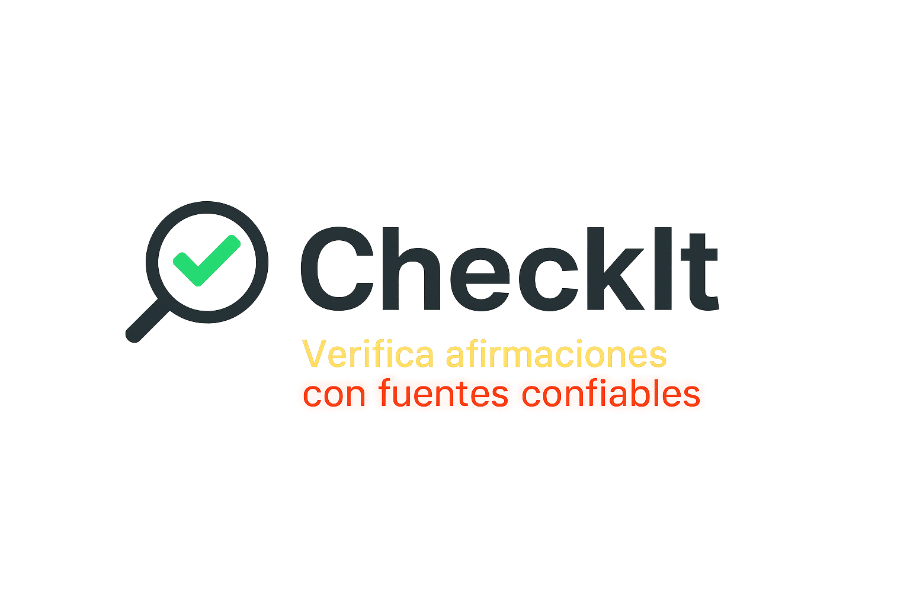

# CheckIt 🔍

**CheckIt** es una aplicación web diseñada para ayudar a los usuarios a verificar afirmaciones utilizando fuentes confiables mediante la integración con la API de Google Fact Check Tools. Su interfaz clara y dinámica permite realizar búsquedas rápidas, interpretar resultados fácilmente y acceder a verificaciones recientes en un solo lugar.

---

## 🚀 Funcionalidades principales

- 🔍 **Búsqueda de afirmaciones** verificadas en tiempo real
- 🌍 Selector de región: `Argentina` / `Internacional`
- 🟢🟡🔴 Veredictos visuales con etiquetas de veracidad (`Verdadero`, `Falso`, `Engañoso`, etc.)
- ⌛ Visualización de **verificaciones recientes** en ausencia de coincidencias
- 🔄 Botón de limpieza para restablecer la búsqueda
- 🖼️ Favicon y splash screen personalizados para reforzar identidad visual

---

## 🛠️ Tecnologías utilizadas

- **React** – Vite como entorno de desarrollo
- **CSS** (modular, en un archivo centralizado)
- **Google Fact Check Tools API**
- **Netlify** / **GitHub Pages** para despliegue

---

## 📁 Estructura del proyecto


---

## 🔐 Variables de entorno

Para que la app funcione correctamente, creá un archivo `.env` en la raíz del proyecto con la clave de tu API:
VITE_FACTCHECK_API_KEY=tu_clave_de_api_aquí

Podés obtener una clave gratuita desde: https://developers.google.com/fact-check/tools/api

---
 
## 🧪 Cómo iniciar la app

1. Cloná el repositorio  
   ```bash
   git clone https://github.com/e-legal/checkit.git
   cd checkit
2. Instalá las dependencias
    bash
    npm install
3. Ejecutá en modo desarrollo
    bash
    npm run dev
4. Abrí en tu navegador: http://localhost:5173

📝 Créditos
Desarrollado con precisión y visión crítica por Ana Sposito. El arte visual y la arquitectura de interfaz reflejan un enfoque centrado en el usuario, la veracidad y el detalle.

📄 Licencia
Este proyecto se distribuye bajo la MIT License.